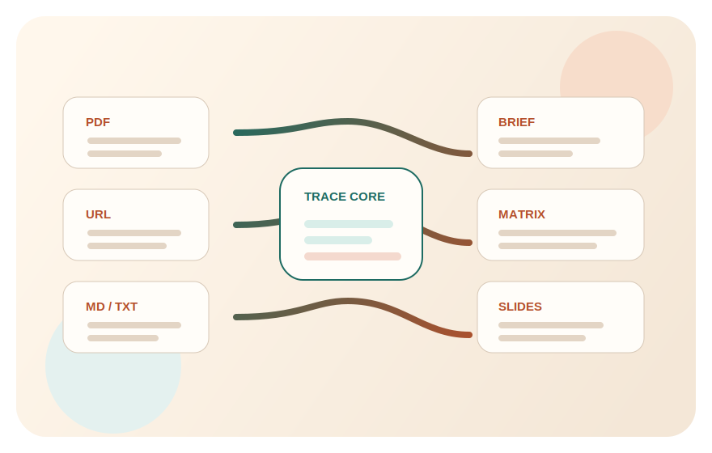

# CiteCraft

`CiteCraft` is the current public-facing working name for a broader AI deliverables workbench.
The codebase stays intentionally neutral while the brand is still provisional.

> Turn messy sources into cited deliverables.
>
> 把杂乱资料变成带引用、可交付的成果。



This project is building an `Academia-first, not academia-only` workbench for source-heavy knowledge work.
它以学术场景作为首个演示入口，但底层结构从第一天就支持扩展到 research、consulting、policy 和更广的知识工作场景。

You give it `PDFs`, `URLs`, and `markdown/text folders`.
It gives you deliverables you can actually use:

- `cited brief`
- `literature matrix`
- `slides`

The product goal is not "better chat." The goal is a deterministic, traceable path from messy inputs to professional output.
这不是另一个聊天壳，也不是泛 agent 平台；它的核心是 `evidence-bound deliverables`。

## P0 Principles

- Every important claim should point back to a source chunk.
- Deliverables are generated as structured models first, then rendered.
- Human-readable output follows `Canonical markdown, rendered everywhere.`
- The web app is a demo shell, not a long-term frontend commitment.
- The golden path is the fixed sample project in `examples/academia/demo-01/`.

## Repo Shape

```text
src/workbench/    # neutral Python core
apps/web/         # demo shell
templates/        # deliverable and render templates
examples/         # sample projects and expected outputs
tests/            # unit, integration, acceptance
docs/             # contracts and architecture notes
```

## Quick Start

The repo has been tested with `D:\anaconda3\python.exe` on this machine because the Windows Store `python` alias is broken.

```powershell
D:\anaconda3\python.exe -m pip install -e .[dev]
$env:PYTHONPATH='src'
D:\anaconda3\python.exe -m workbench.pipeline.run examples/academia/demo-01 --output-dir examples/academia/demo-01/expected
D:\anaconda3\python.exe apps\web\app.py
```

Then open `http://127.0.0.1:5000`.

The local demo shell now supports:

- English / Chinese UI switching
- an `academia` track and a `research / consulting` track
- traceable preview flows for `brief`, `literature_matrix`, and `slides`

Try:

- `http://127.0.0.1:5000/?lang=en&project=academia-demo-01`
- `http://127.0.0.1:5000/?lang=zh&project=research-demo-01`

## Optional Model Provider

The default demo is deterministic so the 1-minute path stays stable.
To try a real model through an OpenAI-compatible endpoint:

```powershell
$env:WORKBENCH_PROVIDER="openai-compatible"
$env:WORKBENCH_API_KEY="..."
$env:WORKBENCH_MODEL="gpt-4.1-mini"
$env:WORKBENCH_BASE_URL="https://api.openai.com/v1"
D:\anaconda3\python.exe -m workbench.pipeline.run examples/academia/demo-01 --provider openai-compatible
```

If provider config is missing or a request fails, the demo safely falls back to deterministic seed text.

## Current Scope

P0 includes:

- source adapters for `PDF`, `URL`, and `markdown/text folder`
- a deterministic pipeline
- a narrow provider seam for future model-backed generation
- evidence traces with clear locators
- structured contracts for `brief`, `literature_matrix`, and `slides`
- markdown and HTML rendering
- a stable 1-minute demo path

P1 will add:

- `reviewer rebuttal draft`
- PPTX export
- stronger citation QA
- broader cross-domain examples
